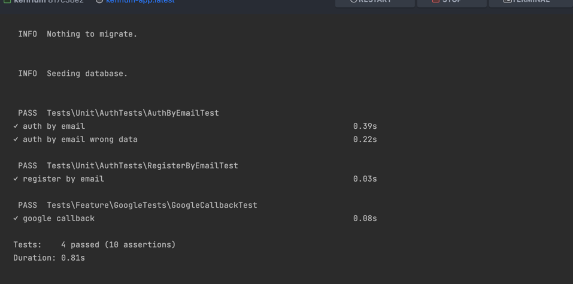

# Запуск

```shell
cp .env.example .env
```
```shell
docker compose up -d
```
Миграции/сидирование/тексты прогоняется в entrypoint.sh (В дальнейшем тесты можно запихнуть в healthcheck и откатывать контейнер при ошибке)


## dev

```shell
composer pint  //run php-cs-fixer
```
